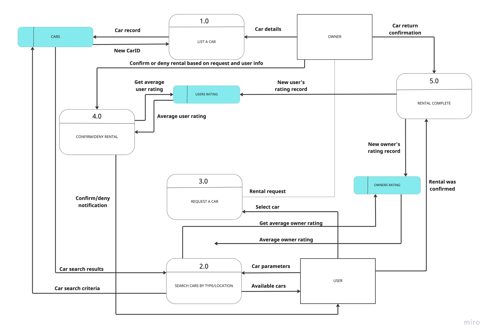

# T3A2_A Carental Irina and Michelle

Car Rental APP

**R1 Description of your website**

**Purpose:**

Carental is the new way to rent a car. We want to make car sharing simple to use, cost-effective, and environmentally friendly.

Care owner can share their cars with others when they are in use and earn some extra income.
For the users, no need to hire a car for a location that you can't necessarily get to or pay expensive hiring fees, just rent one from someone in your area. It's as simple as that.

**Functionality/ Features:**

As a user wanting to hire a car, simply search by location and date needed and book the car you want. The owner will confirm the booking and you're good to go. Rate the car once your booking is complete.

As a car owner, list your car and it's availability for hire. Approve the booking request and rate the user.

This app will allow the car owner to add images of their car, select special features such as sun roof, child seat, etc and set the price per day.

**Target Audience:**

Owners = Anyone over 21 years of age (has a current drivers license) who owns a car and that car is less than 10 years old and registered.

Users = Anyone over 21 years of age who has a current drivers license.

**Tech Stack**
Miro
Trello
GitHub
Discord

**R2 Dataflow Diagram**

**R3 Application Architecture Diagram**

