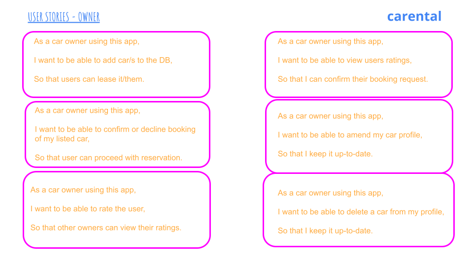
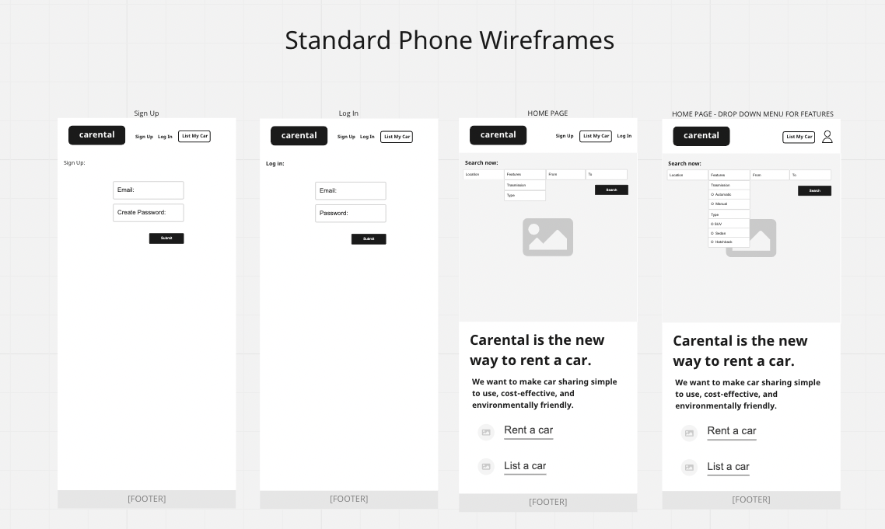
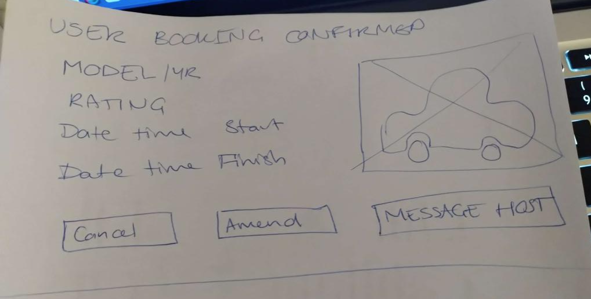
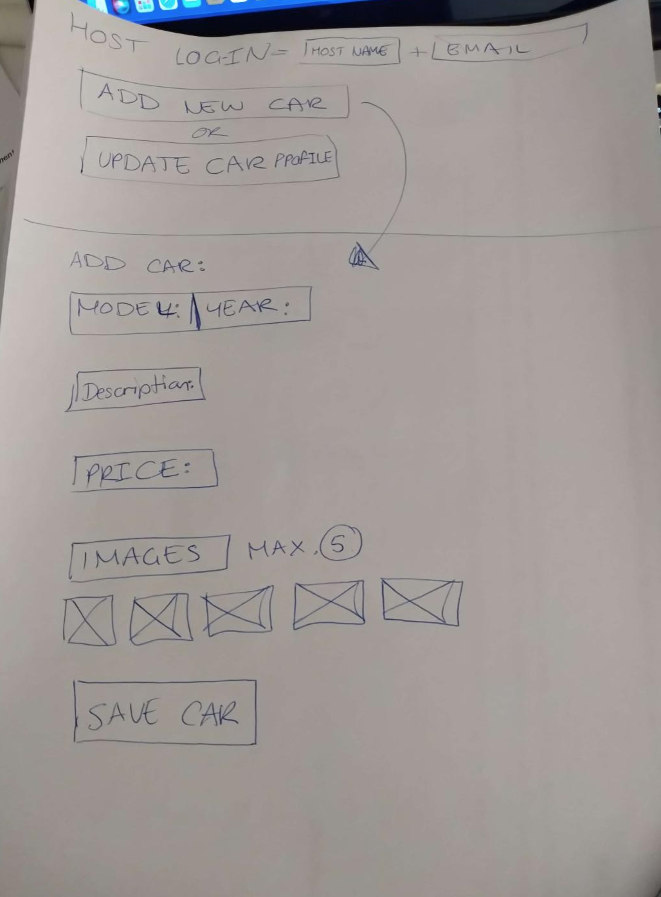

# T3A2_A Carental Irina and Michelle

**CARENTAL** A car rental APP

[Github repository](https://github.com/MichelleOha/T3A2_A_Carental_Irina-Michelle)

**R1 Description of your website**

**Purpose:**

Carental is the new way to rent a car. We want to make car sharing simple to use, cost-effective and environmentally friendly.

Car owners can share their cars with others when they are not in use and earn some extra income.
For the users, no need to hire a car for a location that you can't necessarily get to or pay expensive hiring fees, just rent one from someone in your area. It's as simple as that.

**Functionality/ Features:**

As a user wanting to hire a car, simply search by location and by the date required and book the car you want. The owner will confirm the booking and you're good to go. Rate the car once your booking is complete.

As a car owner, list your car and its availability for hire. Approve the booking request and rate the user.

This app will allow the car owner to add images of their car, select special features such as transmission and set the price per day.

Both the user and owner are able to cancel a booking simply by going into their profile, selecting the booking they wish to cancel and pressing a cancel button.

**Target Audience:**

- Australian residence.

- Owners and users can be anyone over 21 years of age who has a full current Australian drivers license.

- Owners must own their car and it must be registered.

**Tech Stack:**

- Javascript
- MongoDB
- React
- HTML
- CSS
- material ui
- Node JS
- Mongoose
- Express

**Project Management Tools:**

- Miro
- Trello

**R2 Dataflow Diagram**

**R3 Application Architecture Diagram**

**R4 User Stories**

Users Stories:

Owners Stories:

**R5 Wireframes**

Standard Desktop Wireframes:

Standard Phone Wireframes:

Standard Tablet Wireframes:

Brainstorming sketches for wireframes:

Colour Palette for inspiration for website:

**R6 Trello Boards**

[Trello board](https://trello.com/b/MIjLtO2T/carental-application)

Created Trello board with initial tasks for Part A of project:

Added colour labels for each section "To do", "In Progress" and "Done". Also added users to specific cards:

Added checklists for some of the cards, for example the README where we were to divide the tasks between us:

Added a second label colour once we added Part B tasks so that we knew which belonged to Part A (purple) and which belonged to Part B (blue):

Added our initials to tasks on the checklists so we knew who was going to complete which requirement:

Part A almost completed. Part B in progress:

